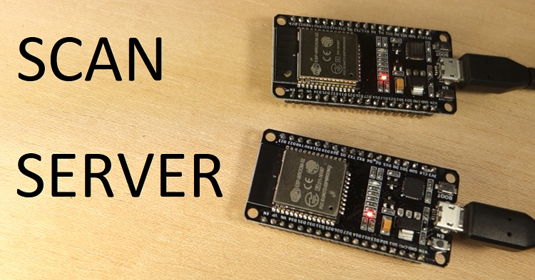

# **Ejercicio voluntario práctica 4. BLE**
En este ejercico voluntario 
 BLE ( bluetooth low energy) necesitaremos dos placas ESP32, una nos servirá para escanear y la otra será el servidor.

 ## **Funcionamiento**

 Este código inicializa el ESP32 como un dispositivo BLE y escanea dispositivos cercanos.
 Para empezar debemos aclarar cual de las dos ESP32 va a ser el "server" y cual va a ser el "scanner".
 Implementamos el codigo server a una placa, y la dejamos connectada a corriente. Posteriormente implementamos el código scanner a la otra placa y empezara a buscar los dispositivos connectados al bluetooth.


 
 

Una vez que el código se haya cargado, debes tener los dos tableros ESP32 encendidos:

- Un ESP32 con el sketch "BLE_server";
- Otro con el sketch "BLE_scan" de ESP32.


### **Codigo completo SCANNER**
```cpp
//SCANNER

#include <Arduino.h>
#include <BLEDevice.h>
#include <BLEUtils.h>
#include <BLEScan.h>
#include <BLEAdvertisedDevice.h>

int scanTime = 5; //In seconds
BLEScan* pBLEScan;

class MyAdvertisedDeviceCallbacks: public BLEAdvertisedDeviceCallbacks {
    void onResult(BLEAdvertisedDevice advertisedDevice) {
      Serial.printf("Advertised Device: %s \n", advertisedDevice.toString().c_str());
    }
};

void setup() {
  Serial.begin(115200);
  Serial.println("Scanning...");

  BLEDevice::init("");
  pBLEScan = BLEDevice::getScan(); //create new scan
  pBLEScan->setAdvertisedDeviceCallbacks(new MyAdvertisedDeviceCallbacks());
  pBLEScan->setActiveScan(true); //active scan uses more power, but get results faster
  pBLEScan->setInterval(100);
  pBLEScan->setWindow(99);  // less or equal setInterval value
}

void loop() {
  // put your main code here, to run repeatedly:
  BLEScanResults foundDevices = pBLEScan->start(scanTime, false);
  Serial.print("Devices found: ");
  Serial.println(foundDevices.getCount());
  Serial.println("Scan done!");
  pBLEScan->clearResults();   // delete results fromBLEScan buffer to release memory
  delay(2000);
}
```
### **Codigo completo SERVER**

```cpp
// SERVER
#include <Arduino.h>
#include <BLEDevice.h>
#include <BLEUtils.h>
#include <BLEServer.h>


#define SERVICE_UUID        "4fafc201-1fb5-459e-8fcc-c5c9c331914b"
#define CHARACTERISTIC_UUID "beb5483e-36e1-4688-b7f5-ea07361b26a8"

void setup() {
  Serial.begin(115200);
  Serial.println("Starting BLE work!");

  BLEDevice::init("Long name works now");
  BLEServer *pServer = BLEDevice::createServer();
  BLEService *pService = pServer->createService(SERVICE_UUID);
  BLECharacteristic *pCharacteristic = pService->createCharacteristic(
                                         CHARACTERISTIC_UUID,
                                         BLECharacteristic::PROPERTY_READ |
                                         BLECharacteristic::PROPERTY_WRITE
                                       );

  pCharacteristic->setValue("Hello World says Neil");
  pService->start();
  // BLEAdvertising *pAdvertising = pServer->getAdvertising();  // this still is working for backward compatibility
  BLEAdvertising *pAdvertising = BLEDevice::getAdvertising();
  pAdvertising->addServiceUUID(SERVICE_UUID);
  pAdvertising->setScanResponse(true);
  pAdvertising->setMinPreferred(0x06);  // functions that help with iPhone connections issue
  pAdvertising->setMinPreferred(0x12);
  BLEDevice::startAdvertising();
  Serial.println("Characteristic defined! Now you can read it in your phone!");
}

void loop() {
  delay(2000);
}
```
